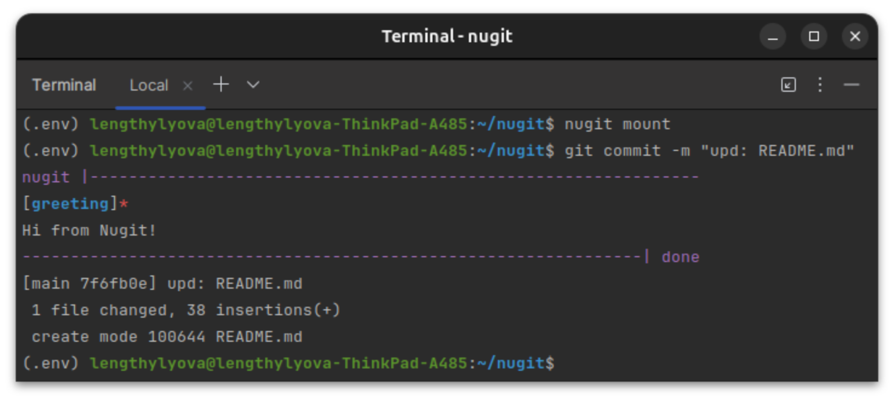

[](https://github.com/lengthylyova/nugit/actions/workflows/flake8-lint.yaml)


---

## About `nugit`
A pre-commit solution tool that works according to the script described in the `nugit.yaml` configuration file.



---

## Installation
```console
pip install nugit
```

---

## Usage
### `nugit.yaml` example
```yaml
settings: # settings are not required
  timeout: 0.5 # timeout between jobs (seconds)

jobs: # jobs are required
  is-vpn-enabled: # job_name
    required: True # is successful completion required?
    run: # commands list
      - echo "Starting VPN check..." # simple command example
      - | # bash script example
        python -u << END
        import sys
        import requests
        
        response = requests.get("https://api.ipify.org?format=json").json()
        if response.get("ip", None) != "${MY_VPN_IP}":
          exit("Incorrect IP for VPN")
        sys.stdout.write("Everything fine!\n")
        END
      - echo "VPN check finished!"

  flake8-lint: # another job name
    quite: True # if quite and no errors - nugit ignores output.
    run: # more common usage example
      - flake8 --version
      - flake8 --extend-exclude=.env,*.egg-info --statistics --color=always --ignore F401 --max-line-length=100
```

### Mount
```console
nugit mount
```
* creates an example `nugit.yaml` configuration file if not exists
* replaces the `pre-commit` file in your `.git/hooks/`

### Run (check)
```console
nugit run
```
* runs `.git/hooks/pre-commit` script if exists

### Remove
```console
nugit remove
```
* removes a `nugit.yaml` configuration file
* removes the `pre-commit` file in your `.git/hooks/`
